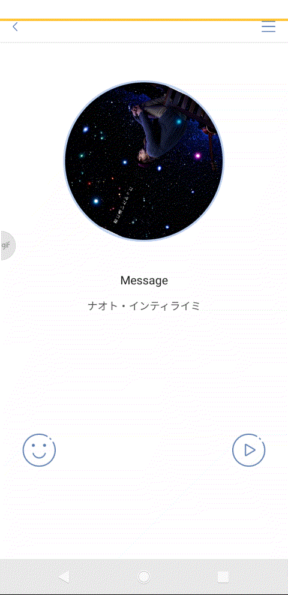
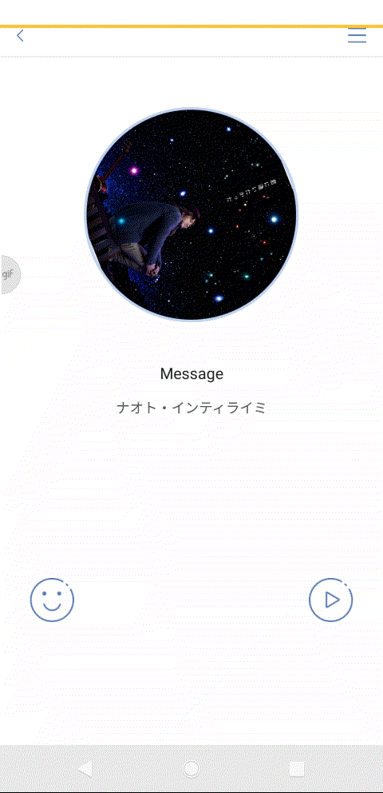
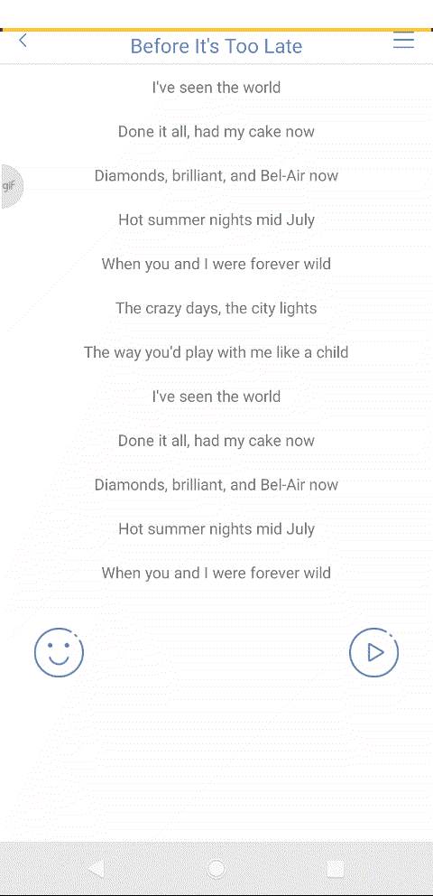
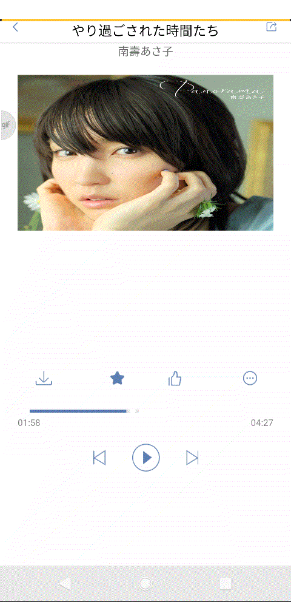

 # 
Elf（半期考核）

 **实现了切换心情歌单、音乐播放控制、侧滑菜单、歌词查看（没有动画）、收藏**

## 侧滑菜单

  **侧滑出现的item没有实现点击事件，布局嵌套层数很多**

 

## 切换心情歌单

 

## 音乐播放的控制

  **还只有一个循环播放**

 

## 歌词

  **还没能实现自动滚动，就先用RecyclerView代替一下**

 

## 收藏歌曲

  **忘记了分类收藏**

 

## 评论区

  **没有...**

 